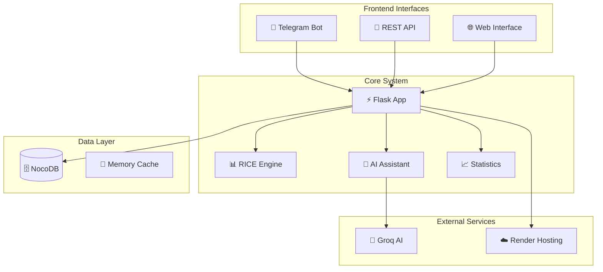

# 🚀 MCP Saludia - Sistema de Gestión de Iniciativas v2.3

## 📋 Índice
- [🎯 Descripción General](#-descripción-general)
- [🏗️ Arquitectura del Sistema](#️-arquitectura-del-sistema)
- [🔧 Configuración y Deployment](#-configuración-y-deployment)
- [📊 Metodología RICE](#-metodología-rice)
- [🤖 Bot de Telegram](#-bot-de-telegram)
- [🔌 API REST](#-api-rest)
- [🧠 Asistente de IA](#-asistente-de-ia)
- [📈 Análisis y Estadísticas](#-análisis-y-estadísticas)
- [🔍 Sistema de Búsqueda](#-sistema-de-búsqueda)
- [⚡ Funcionalidades Nuevas v2.3](#-funcionalidades-nuevas-v23)

---

## 🎯 Descripción General

**MCP Saludia** es un sistema especializado de gestión de iniciativas para equipos internos de Saludia, implementando la metodología **RICE** (Reach × Impact × Confidence / Effort) para priorización estratégica.

### 🏢 Contexto de Negocio
- **Empresa:** Saludia - Marketplace farmacéutico
- **Misión:** Conectar droguerías independientes con sellers y laboratorios
- **Objetivo:** Democratizar el acceso a productos farmacéuticos

### 👥 Equipos Internos
- **Product** - Desarrollo de funcionalidades del marketplace
- **Sales** - Acquisition de droguerías y sellers  
- **Ops** - Gestión operacional y fulfillment
- **CS** - Customer Success y soporte
- **Controlling** - Control financiero y métricas
- **Growth** - Marketing y crecimiento

---

## 🏗️ Arquitectura del Sistema



### 🔄 Flujo de Datos
1. **Input** → Telegram Bot / API REST
2. **Processing** → Flask + RICE Engine
3. **Storage** → NocoDB Database
4. **Analysis** → AI Assistant (Groq)
5. **Output** → Estadísticas ordenadas por score

---

## 🔧 Configuración y Deployment

### 📦 Dependencias (requirements.txt)
```txt
Flask==3.0.0
Flask-CORS==4.0.0
requests==2.31.0
python-telegram-bot==20.3
gunicorn==21.2.0
```

### 🌐 Variables de Entorno

#### Configuración en Render:
```bash
# ✅ Variable requerida
GROQ_API_KEY=gsk_your_groq_api_key_here

# ❌ NO configurar PORT - Render lo maneja automáticamente
```

#### Configuración Local:
```bash
GROQ_API_KEY=gsk_your_groq_api_key_here
PORT=10000  # Solo para desarrollo local
```

### 🚀 Deployment en Render

#### 1. Configuración del Servicio:
- **Build Command:** `pip install -r requirements.txt`
- **Start Command:** `gunicorn app:app`
- **Puerto:** Automático (no configurar)
- **Región:** US East (Ohio) recomendada

#### 2. Variables de Entorno:
```bash
GROQ_API_KEY=tu_clave_de_groq
```

#### 3. Configuración Automática de Puertos:
- ✅ **Render asigna automáticamente** el puerto (típicamente 10000)
- ✅ **Sin conflictos** entre Flask y Gunicorn
- ✅ **Logs limpios** sin errores de puerto

### 🔗 URLs del Sistema:
- **Producción:** `https://mpciniciativas.onrender.com`
- **API Base:** `https://mpciniciativas.onrender.com/api`
- **Webhook Telegram:** `https://mpciniciativas.onrender.com/telegram-webhook`

---

## 📊 Metodología RICE

### 🧮 Fórmula de Score
```
Score RICE = (Reach × Impact × Confidence) / Effort
```

### 📏 Métricas Detalladas

#### 🎯 Reach (Alcance)
- **Rango:** 0.0 - 1.0 (0% - 100%)
- **Definición:** Porcentaje de usuarios impactados
- **Ejemplos:**
  - `0.85` → 85% de usuarios
  - `0.25` → 25% de usuarios
  - `1.0` → Todos los usuarios

#### 💥 Impact (Impacto)
- **Rango:** 1, 2, 3
- **Definición:** Nivel de impacto en KPI principal
- **Escala:**
  - `1` → Impacto bajo
  - `2` → Impacto medio
  - `3` → Impacto alto

#### 🎯 Confidence (Confianza)
- **Rango:** 0.0 - 1.0 (0% - 100%)
- **Definición:** Porcentaje de confianza en el impacto estimado
- **Ejemplos:**
  - `0.9` → 90% de confianza
  - `0.7` → 70% de confianza
  - `0.5` → 50% de confianza

#### ⚡ Effort (Esfuerzo)
- **Rango:** > 0 (decimal)
- **Unidad:** Sprints/semanas de desarrollo
- **Ejemplos:**
  - `1.0` → 1 sprint
  - `2.5` → 2.5 sprints
  - `0.5` → Medio sprint

### 🏆 Sistema de Priorización

#### 🔥 Alta Prioridad (Score ≥ 2.0)
- **Emoji:** 🔥
- **Acción:** Ejecutar inmediatamente
- **Características:** Alto ROI, impacto significativo

#### ⭐ Media Prioridad (1.0 ≤ Score < 2.0)
- **Emoji:** ⭐
- **Acción:** Planificar para próximos sprints
- **Características:** ROI positivo, impacto moderado

#### 📋 Baja Prioridad (Score < 1.0)
- **Emoji:** 📋
- **Acción:** Evaluar necesidad o re-estimar
- **Características:** ROI bajo, considerar cancelación

---

## 🤖 Bot de Telegram

### 🚀 Comandos Principales

#### 📱 Comandos Básicos
```bash
/start    # Bienvenida e introducción
/help     # Lista completa de comandos
```

#### 📋 Gestión de Iniciativas
```bash
iniciativas           # Lista ordenada por score RICE
buscar <término>      # Búsqueda con información completa
crear                 # Nueva iniciativa (8 pasos)
```

#### 📊 Análisis y Reportes
```bash
analizar             # Análisis AI + rankings por score
estadísticas         # Resumen con top scores
```

### 🔍 Ejemplos de Búsqueda
```bash
buscar Product       # Por equipo
buscar droguería     # Por término en descripción
buscar Juan          # Por responsable
buscar API          # Por tecnología/KPI
```

### 📝 Proceso de Creación (8 Pasos)

#### Paso 1: Nombre
- **Input:** Texto libre
- **Límite:** 255 caracteres
- **Ejemplo:** "Integración API de pagos"

#### Paso 2: Descripción
- **Input:** Texto libre
- **Límite:** 1000 caracteres
- **Ejemplo:** "Implementar sistema de pagos con PSE y tarjetas para mejorar conversión"

#### Paso 3: Responsable
- **Input:** Nombre completo
- **Límite:** 100 caracteres
- **Ejemplo:** "Juan Pérez"

#### Paso 4: Equipo
- **Input:** Enum validado
- **Opciones:** Product, Sales, Ops, CS, Controlling, Growth

#### Paso 5: Portal
- **Input:** Enum validado
- **Opciones:** Seller, Droguista, Admin

#### Paso 6: KPI Principal (Opcional)
- **Input:** Texto libre o "ninguno"
- **Límite:** 255 caracteres
- **Ejemplo:** "Conversion Rate"

#### Paso 7: Métricas RICE
- **Reach:** 0-100 (convertido a 0.0-1.0)
- **Impact:** 1, 2, o 3
- **Confidence:** 0-100 (convertido a 0.0-1.0)
- **Effort:** Número decimal > 0 (default: 1.0)

#### Paso 8: Confirmación
- **Validación completa** de datos
- **Cálculo automático** de score RICE
- **Asignación de prioridad** visual
- **Creación en base** de datos

---

## 🔌 API REST

### 🏠 Endpoint Principal
```http
GET /
```
**Respuesta:** Información del sistema, estado y configuración

### 🏥 Health Check
```http
GET /health
```
**Respuesta:** Estado detallado de servicios (NocoDB, Telegram, AI)

### 📋 Gestión de Iniciativas

#### Listar Iniciativas (Ordenadas por Score)
```http
GET /api/initiatives
```
**Respuesta:**
```json
{
  "success": true,
  "data": [
    {
      "id": 1,
      "initiative_name": "API de Pagos",
      "description": "Implementar PSE y tarjetas",
      "owner": "Juan Pérez",
      "team": "Product",
      "portal": "Droguista",
      "main_kpi": "Conversion Rate",
      "reach": 0.85,
      "impact": 3,
      "confidence": 0.9,
      "effort": 2.0,
      "score": 1.1475,
      "status": "Pending",
      "calculated_score": 1.1475
    }
  ]
}
```

#### Buscar Iniciativas
```http
GET /api/initiatives/search?q=<término>&field=<campo>
```
**Parámetros:**
- `q`: Término de búsqueda (requerido)
- `field`: Campo específico (opcional: all, name, owner, team, kpi, portal, description)

#### Crear Iniciativa
```http
POST /api/create
Content-Type: application/json

{
  "initiative_name": "Nueva Iniciativa",
  "description": "Descripción detallada",
  "owner": "Responsable",
  "team": "Product",
  "portal": "Seller",
  "main_kpi": "GMV",
  "reach": 0.7,
  "impact": 2,
  "confidence": 0.8,
  "effort": 1.5,
  "must_have": false
}
```

#### Estadísticas Avanzadas
```http
GET /api/initiatives/statistics
```
**Respuesta:** Estadísticas completas con rankings por score

### 🧠 Análisis con IA
```http
POST /ai/analyze-initiatives
```
**Respuesta:** Análisis estratégico especializado en Saludia

### 🔗 Configuración de Webhook
```http
POST /setup-webhook
```
**Función:** Configurar webhook de Telegram automáticamente

---

## 🧠 Asistente de IA

### 🎯 Especialización en Saludia

#### 🏢 Contexto de Negocio
- **Marketplace farmacéutico** B2B
- **Stakeholders:** Droguerías, Sellers, Laboratorios
- **Métricas clave:** GMV, Take Rate, Retention, NPS

#### 📊 Capacidades de Análisis
1. **Evaluación de ranking** por score RICE
2. **Balance entre equipos** y tipos de iniciativas
3. **Identificación de gaps** estratégicos
4. **Optimización de recursos** basada en ROI
5. **Recomendaciones** de priorización
6. **Insights accionables** para marketplace

### 🤖 Ejemplos de Análisis

#### Análisis de Portfolio:
> "El equipo de Product tiene el 40% de iniciativas con score promedio de 1.8. Se recomienda priorizar la integración de pagos (score 2.1) sobre el dashboard interno (score 0.8). Gap identificado: falta de iniciativas de retención en CS."

#### Recomendaciones Estratégicas:
> "Para maximizar GMV Q4, enfocar recursos en iniciativas de alta conversión (Droguista portal) y diferir mejoras internas (Admin portal) hasta Q1."

---

## 📈 Análisis y Estadísticas

### 🏆 Rankings Automáticos

#### Top 5 Iniciativas por Score
```
1. API de Pagos - Score: 2.15 (Product - Juan Pérez)
2. Onboarding Sellers - Score: 1.89 (Sales - María García)
3. Dashboard Analytics - Score: 1.67 (Controlling - Carlos López)
4. Chat de Soporte - Score: 1.45 (CS - Ana Martín)
5. SEO Optimization - Score: 1.23 (Growth - Luis Rodríguez)
```

#### Distribución por Equipos
```
• Product: 12 iniciativas (35.3%)
• Sales: 8 iniciativas (23.5%)
• Ops: 6 iniciativas (17.6%)
• CS: 4 iniciativas (11.8%)
• Growth: 3 iniciativas (8.8%)
• Controlling: 1 iniciativa (2.9%)
```

### 📊 Métricas Promedio
- **Alcance promedio:** 67.3%
- **Impacto promedio:** 2.1/3
- **Confianza promedio:** 78.5%
- **Esfuerzo promedio:** 1.8 sprints
- **Score promedio:** 1.47

### 📈 KPIs Más Comunes
1. **Conversion Rate** - 8 iniciativas (23.5%)
2. **GMV** - 6 iniciativas (17.6%)
3. **User Retention** - 4 iniciativas (11.8%)

---

## 🔍 Sistema de Búsqueda

### 🎯 Características Avanzadas

#### Búsqueda Multi-Campo
- **Nombre** de iniciativa
- **Descripción** completa
- **Responsable** (owner)
- **Equipo** asignado
- **KPI** principal
- **Portal** objetivo

#### Ordenamiento Inteligente
1. **Por score RICE** (descendente)
2. **Por relevancia** del término
3. **Por prioridad** visual (🔥 ⭐ 📋)

#### Resultados Detallados
```
🔥 API de Pagos (Score: 2.15)
📝 Descripción: Implementar sistema de pagos con PSE...
👤 Responsable: Juan Pérez
👥 Equipo: Product
📊 KPI Principal: Conversion Rate
🖥️ Portal: Droguista
📋 Status: Pending

📈 Métricas RICE:
• Alcance: 85%
• Impacto: 3/3
• Confianza: 90%
• Esfuerzo: 2.0 sprints
• Score RICE: 2.15
```

---

## ⚡ Funcionalidades Nuevas v2.3

### 🎯 Mejoras en Priorización

#### 🏆 Ordenamiento Automático por Score RICE
- **Todas las listas** ordenadas de mayor a menor score
- **Rankings dinámicos** en estadísticas
- **Priorización visual** con emojis

#### 📊 Sistema de Prioridad Visual
```
🔥 Score ≥ 2.0  → Alta prioridad
⭐ Score ≥ 1.0  → Media prioridad
📋 Score < 1.0  → Baja prioridad
```

### 🔍 Búsqueda Mejorada

#### Información Completa
- **Descripción completa** en resultados
- **Métricas RICE detalladas**
- **Contexto del proyecto**
- **Estado actual**

#### Relevancia + Score
- **Ordenamiento dual:** relevancia del término + score RICE
- **Resultados priorizados** automáticamente
- **Top 5 por defecto** para evitar sobrecarga

### 📈 Estadísticas Avanzadas

#### Top Rankings
- **Top 10 iniciativas** por score
- **Top 5 equipos** más activos
- **Top 5 responsables** con más proyectos
- **Top 3 KPIs** más comunes

#### Métricas Mejoradas
- **Porcentajes precisos** de distribución
- **Promedios ponderados** por score
- **Score promedio** del portfolio
- **Insights de balance** entre equipos

### 🤖 IA Especializada

#### Análisis Estratégico
- **Enfoque en score RICE** como factor principal
- **Recomendaciones priorizadas**
- **Gaps identificados** por baja puntuación
- **Optimización de recursos** basada en ROI

#### Contexto de Saludia
- **Conocimiento del negocio** farmacéutico
- **Stakeholders específicos**
- **Métricas de marketplace**
- **Insights accionables**

### 🔧 Mejoras Técnicas

#### Gestión de Puertos
- **Configuración automática** para Render
- **Sin conflictos** entre Flask y Gunicorn
- **Logs limpios** sin errores de puerto

#### Validaciones Robustas
- **8 pasos de validación** en creación
- **Esquema de datos** estricto
- **Manejo de errores** mejorado
- **Feedback detallado** al usuario

#### Performance
- **Cálculo eficiente** de scores
- **Caché en memoria** para estadísticas
- **Ordenamiento optimizado**
- **Respuestas rápidas** en API

---

## 🛠️ Troubleshooting

### ❌ Problemas Comunes

#### Error de Puerto en Render
**Síntoma:** `Continuing to scan for open port 5000`
**Solución:** No configurar variable `PORT` en Render

#### Webhook de Telegram no responde
**Síntoma:** Bot no recibe mensajes
**Solución:** Ejecutar `POST /setup-webhook`

#### Error de validación en creación
**Síntoma:** Datos rechazados
**Solución:** Verificar formato exacto de equipos y portales

#### IA no disponible
**Síntoma:** "Asistente AI no está disponible"
**Solución:** Configurar `GROQ_API_KEY` en variables de entorno

### ✅ Verificación del Sistema

#### Health Check Completo
```bash
curl https://mpciniciativas.onrender.com/health
```

#### Test de API
```bash
curl https://mpciniciativas.onrender.com/api/initiatives
```

#### Configuración de Webhook
```bash
curl -X POST https://mpciniciativas.onrender.com/setup-webhook
```

---

## 📞 Soporte y Contacto

### 🔧 Mantenimiento
- **Desarrollador:** Equipo de Product Saludia
- **Monitoreo:** Logs automáticos en Render
- **Actualizaciones:** Deploy automático desde repositorio

### 📚 Recursos Adicionales
- **Documentación RICE:** [Metodología oficial](https://www.productplan.com/glossary/rice-scoring-model/)
- **API de Telegram:** [Documentación oficial](https://core.telegram.org/bots/api)
- **Groq AI:** [Documentación de API](https://console.groq.com/docs)

### 🆘 Escalación
Para problemas críticos o mejoras del sistema, contactar al equipo de Product de Saludia.

---

**📅 Última actualización:** Agosto 2025 - v2.3  
**🎯 Próximas mejoras:** Dashboard web, integración con JIRA, métricas avanzadas de ROI
